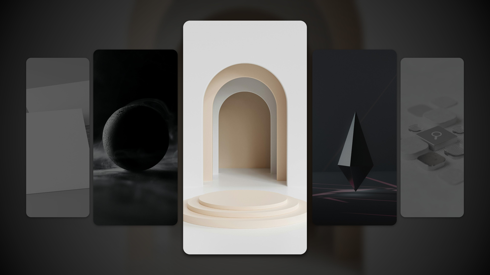

# Modernized Gallery



Welcome to **Modernized Gallery**, a minimalist gallery project built with pure HTML, CSS and JavaScript.

## Usage

1. Clone or download the repository.
2. Place your image files (e.g., JPEG, PNG) in the `images` directory.
3. Open `index.html` in your browser.

```bash
# Clone the repository
git clone https://github.com/ForeverWeLearn/modernized-gallery.git

# Navigate into the project directory
cd modernized-gallery

# Open in your browser
open index.html
```

## Customization

- Update the `index.html` file to include your desired images.
- Modify the `styles.css` file to change colors, spacing, or layout.
- Modify the `script.css` file to change effects, switch interval.

## Contributing

Contributions are welcome! If you have suggestions or improvements, feel free to create a pull request or open an issue.

## License

This project is licensed under the [MIT License](./LICENSE).

---

Enjoy creating with Modernized Gallery! 🎨
